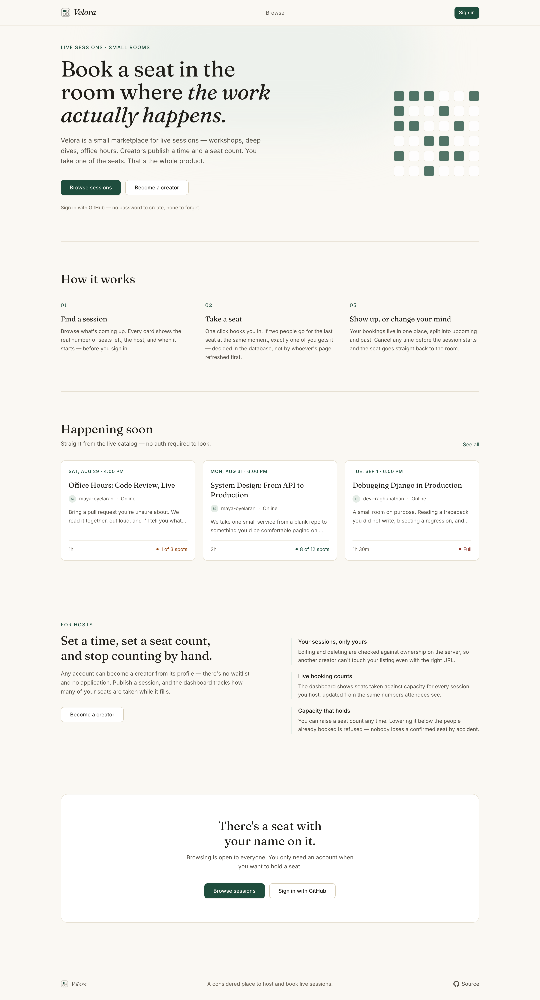
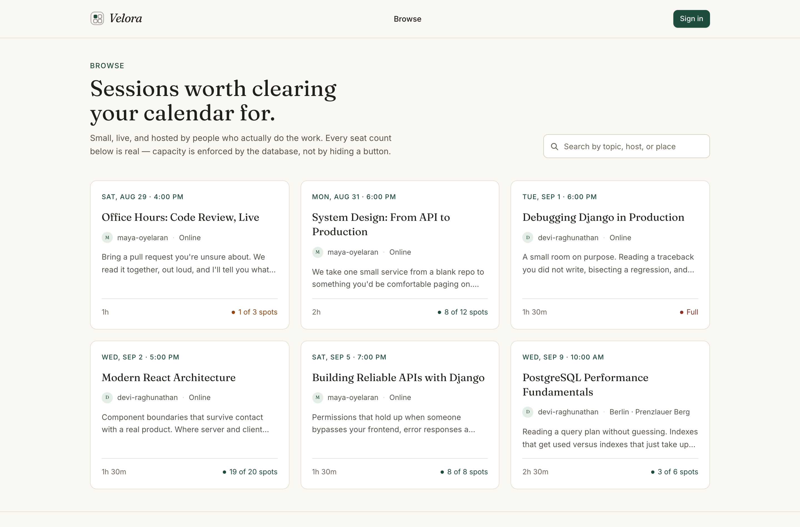
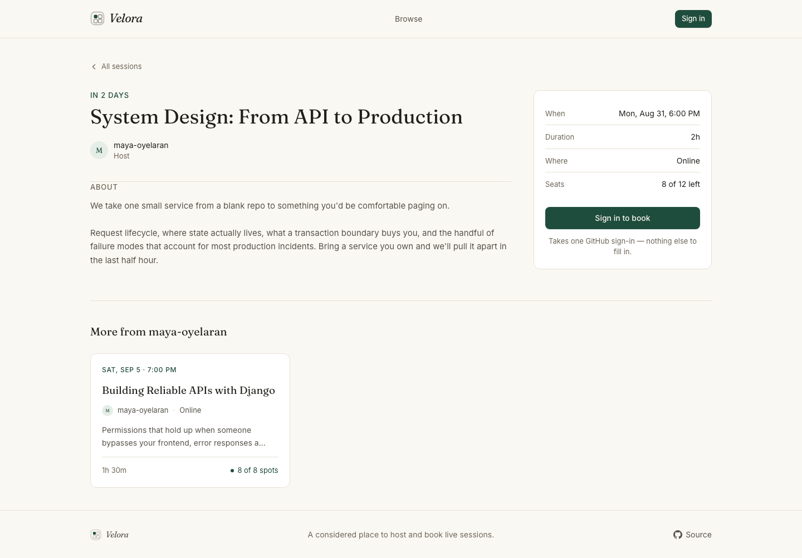
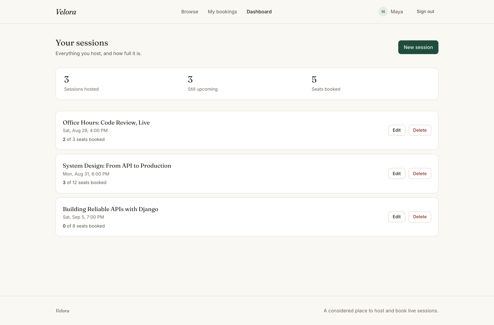
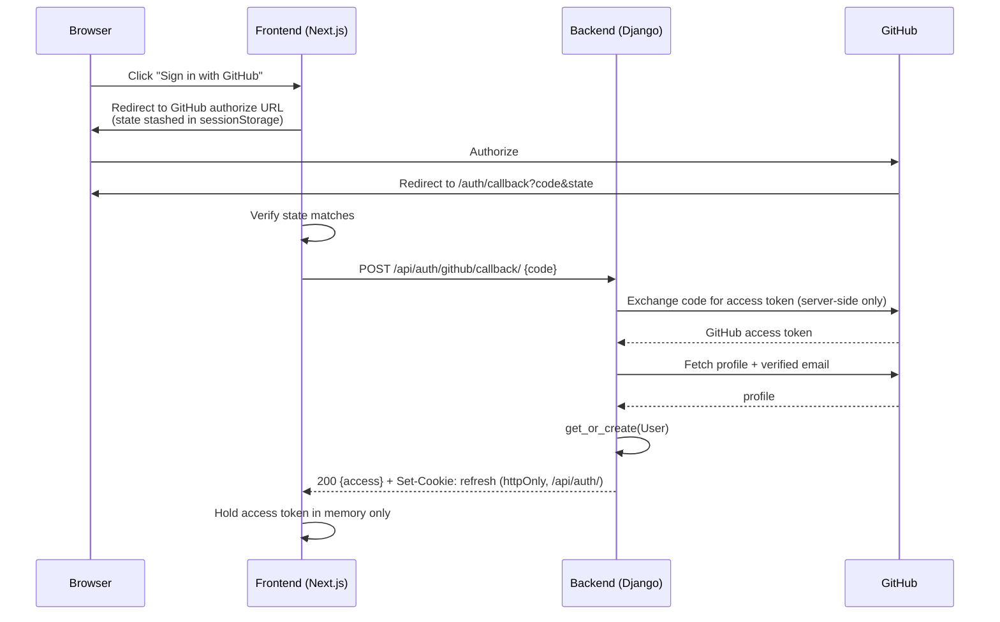
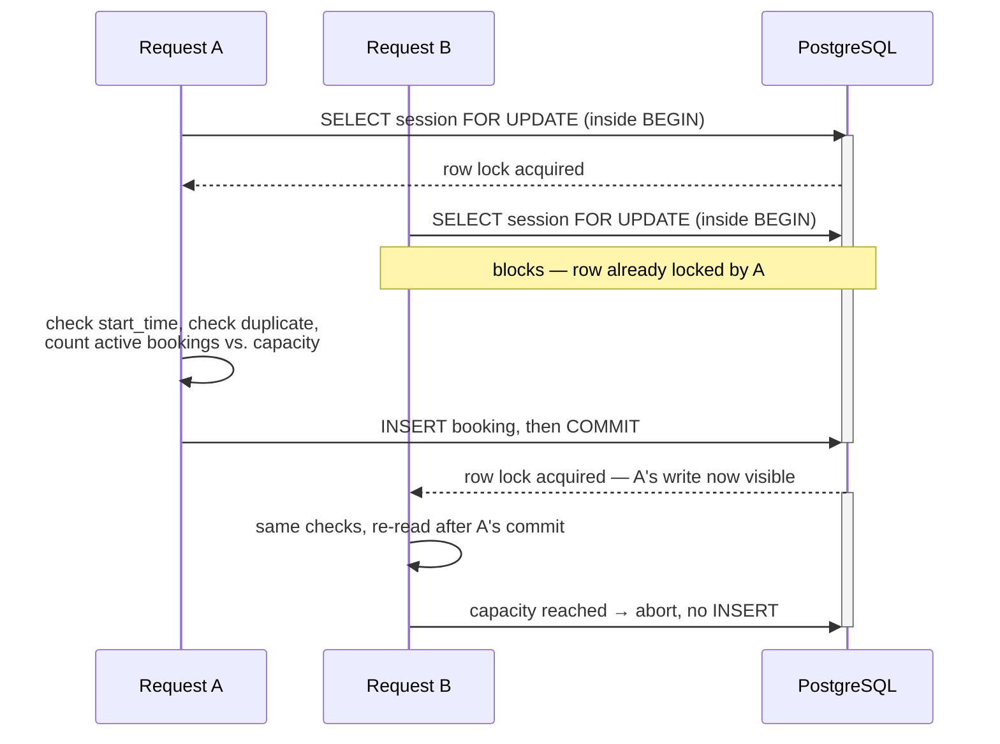

# Velora

A full-stack sessions marketplace: creators publish a time and a seat count, people discover and book one of the seats — with booking correctness enforced by the database, not just the UI.

Built as a full-stack take-home assignment. The focus is on getting the hard part — booking under concurrent load — provably correct, and on backend authorization that actually holds up when you try to break it, rather than on adding extra features.

- **Backend:** Django 5 + Django REST Framework, PostgreSQL 16
- **Frontend:** Next.js 16 (App Router, TypeScript, Tailwind v4)
- **Auth:** GitHub OAuth → backend-issued JWT (access + refresh)
- **Infra:** Docker Compose — Nginx, frontend, backend, Postgres

Related docs: [DECISIONS.md](DECISIONS.md) (why things are built this way), [DEBUGGING.md](DEBUGGING.md) (real bugs, how they were found and fixed), [PROMPT_LOG.md](PROMPT_LOG.md) (how AI was used), [DEPLOYMENT.md](DEPLOYMENT.md) (the optional public deployment), [final verification report](docs/VELORA_FINAL_VERIFICATION_REPORT.pdf) (every requirement checked against evidence).

**One manual step before this runs end to end:** you need to create a GitHub OAuth App and put its credentials in `.env`. There's no API for creating one, so it can't be scripted. See [GitHub OAuth setup](#github-oauth-setup) below.

---

## Why Velora

Booking systems look simple until two people try to take the last seat at the same instant. Most take-home projects either skip that case or handle it in application code, where it's easy to get wrong under real concurrent load. Velora exists to answer one question properly: when the frontend, the network, and two browser tabs can all lie about what happened first, what still guarantees a session never oversells? The answer here is enforced in PostgreSQL, not assumed — see [Booking correctness](#booking-correctness) below.

## What it does

Three roles, one app:

- **Anyone** can browse the catalog and open a session — no account needed.
- A **user** signs in with GitHub, books a seat, and can see their upcoming and past bookings. Cancelling a booking frees the seat immediately.
- A **creator** (any user can become one from their profile) publishes sessions, edits or deletes their own, and sees live booking counts on a dashboard.

## Key features

**For users**
- GitHub sign-in — no password to create, none to forget
- Browse and search the catalog without an account (title, description, location, host)
- Book a seat, cancel it, see upcoming vs. past bookings
- Each session page surfaces other upcoming sessions from the same host

**For creators**
- Create, edit, and delete your own sessions — self-service, no waitlist to become a creator
- A dashboard with live booking counts per session
- Ownership enforced server-side: another creator can't touch your session even with the right URL
- A capacity floor — you can't shrink a session below the people already booked

**Engineering**
- Real concurrency safety on booking — a capacity-1 session cannot be double-booked, proven under load, not just asserted
- GitHub OAuth → JWT access token (in memory) + refresh token (httpOnly cookie)
- Backend-enforced authorization on every write, checked server-side regardless of what the UI shows
- Docker Compose (Nginx, frontend, backend, Postgres), 70 automated backend tests
- Custom visual design (see [DECISIONS.md](DECISIONS.md) #4) instead of default component-library styling

## Product preview

<table>
<tr>
<td width="50%"></td>
<td></td>
</tr>
<tr>
<td>Landing page</td>
<td>Catalog — search, live seat counts, no login required</td>
</tr>
<tr>
<td></td>
<td></td>
</tr>
<tr>
<td>Session detail — real-time seats, plus other sessions from the host</td>
<td>Creator dashboard — live counts against capacity</td>
</tr>
</table>

These were captured against the demo data in `tools/seed_demo.py`. A fresh deployment starts empty.

---

## Architecture


Four containers, one published port. The browser only ever talks to Nginx — frontend and backend are not reachable directly, so there's no CORS to configure and the refresh cookie can be a plain `SameSite=Lax` cookie (see [DECISIONS.md](DECISIONS.md) #3).

**Backend** (`backend/apps/`):
- `accounts` — user model with a `role` field, GitHub OAuth exchange, JWT issuance/refresh/logout, profile
- `catalog` — sessions: public read, creator-owned writes
- `bookings` — the booking model and the capacity-safe booking service, plus a standalone concurrency check (`prove_concurrency`)
- `core` — health check, shared permissions, one consistent error format for the whole API

**Frontend** (`frontend/src/`): landing page, catalog, session detail, login/OAuth callback, profile, bookings, creator dashboard and forms. `lib/auth-context.tsx` and `lib/api-client.ts` hold the token handling; everything else just consumes it. `components/ui/` has the shared building blocks (buttons, cards, dialogs, form fields).

## Tech stack

| Layer | Choice |
|---|---|
| Frontend | Next.js 16, TypeScript, Tailwind v4 |
| Backend | Django 5, Django REST Framework |
| Database | PostgreSQL 16 |
| Auth | GitHub OAuth, `djangorestframework-simplejwt` |
| Infra | Docker Compose, Nginx, gunicorn |
| Testing | pytest (backend), ESLint + `tsc` (frontend) |

---

## Authentication

GitHub OAuth in, JWT out. The flow:



1. The frontend redirects to GitHub's OAuth URL with a random `state` value stashed in `sessionStorage`, so the callback can be verified against CSRF.
2. GitHub redirects back to `/auth/callback` with a `code` (or `error=access_denied` if the user cancels — handled with a plain message and a link back to sign-in, not a crash).
3. The frontend checks `state` matches, then sends the `code` to the backend.
4. The backend exchanges the code for a GitHub token **on the server** — the client secret never touches the browser — fetches the verified email, and creates or looks up the user.
5. The backend returns a short-lived **access token** in the response body and sets the **refresh token** as an httpOnly cookie scoped to `/api/auth/`.
6. The frontend keeps the access token in memory only (never `localStorage`) and refreshes it silently on a 401 or on page load.

**Roles.** `User.role` is `user` or `creator`. Becoming a creator is a self-service profile update (`PATCH /api/auth/me/ {"role": "creator"}`) — it only grants control over your own sessions, not `is_staff` or `is_superuser`, which aren't exposed by that endpoint at all.

**What's enforced server-side, not just hidden in the UI:**
- A user hitting a creator-only endpoint gets a real `403` from a DRF permission class, not a hidden button.
- A creator editing another creator's session gets `403` from an object-level check (`obj.creator_id == request.user.id`) — a crafted request against someone else's session id is rejected regardless of what the UI shows.
- Expired or invalid tokens return `401`; the frontend retries once through a silent refresh before giving up.

---

## Booking correctness

This is the part of the assignment that actually matters: a session's active bookings must never exceed its capacity, even when two requests arrive at the same instant.

**Why a frontend check can't do this.** The UI disabling its own "Book" button when `seats_remaining` hits zero only stops *that* browser. It does nothing about a second tab, a second device, or someone hitting the API directly with curl. Two requests can both read "1 seat left" before either has written anything, and both proceed to book. The frontend has no way to see another request's in-flight write — only the database can serialize that.

**How it's enforced:**



`create_booking()` takes a row lock on the `Session` with `select_for_update()` inside `transaction.atomic()`, then counts active bookings and checks capacity while holding that lock. A second request on the same session blocks at `SELECT ... FOR UPDATE` until the first one commits — so it can only make its decision once the first booking is already counted. That's what closes the race: there's no window where two requests both see "1 seat left."

Two separate invariants, enforced at two separate layers, because they're different kinds of rule:
- **Capacity** (`active bookings ≤ capacity`) is a fact about a group of rows, so it needs the transaction and the lock — a plain `CHECK` constraint can't see other rows.
- **No duplicate active booking** (one user, one session) *is* a single-row fact, so it's also enforced by a partial unique index (`unique_active_booking_per_user_session`) directly in the database, as a backstop independent of the lock.

Full reasoning, including the alternatives that were rejected, is in [DECISIONS.md](DECISIONS.md) #1.

**Proof, not just a claim:**
- `backend/apps/bookings/tests/test_concurrency.py` fires 12 real concurrent requests (separate threads, separate DB connections, released together with a `Barrier`) at a capacity-1 session and checks exactly one succeeds — plus a capacity-3 version, a same-user double-submit version, and 5 repeated runs to catch flakiness.
- To confirm the test actually catches the bug, `select_for_update()` was removed and the suite re-run: all 12 requests succeeded, oversubscribing a 1-seat session 12 times over. Putting the lock back brought it to exactly 1 again. See [DEBUGGING.md](DEBUGGING.md).
- `python manage.py prove_concurrency [--contenders N]` reproduces the same race outside the test suite, against a real running server:
  ```bash
  docker compose exec backend python manage.py prove_concurrency --contenders 15
  ```
  This was also run against the live Docker stack over real HTTP — 12 concurrent `POST /api/bookings/` requests from 12 different users, through Nginx, hitting gunicorn's three worker processes. Result: 1 succeeded, 11 got `409 session_full`.

---

## Project structure

```
backend/apps/
  accounts/    user model, GitHub OAuth, JWT
  catalog/     sessions
  bookings/    booking logic + concurrency proof
  core/        health check, permissions, error format

frontend/src/
  app/         pages (App Router)
  components/  shared UI + session form
  lib/         API client, auth context, types

nginx/          reverse proxy config
tools/          seed_demo.py — local demo data
docs/           screenshots + the verification report
```

## Local setup

**Prerequisites:** Docker, Docker Compose, and a GitHub account (to register an OAuth App).

```bash
cp .env.example .env
```

Fill in `DJANGO_SECRET_KEY` (any long random string — `python -c "import secrets; print(secrets.token_urlsafe(50))"` works) and a `POSTGRES_PASSWORD`, then set up GitHub OAuth below before filling in the rest.

## GitHub OAuth setup

Go to **github.com → Settings → Developer settings → OAuth Apps → New OAuth App** and create one with:

- Homepage URL: `http://localhost:3000`
- Authorization callback URL: `http://localhost:3000/auth/callback`

Put the generated values into `.env`:

```
GITHUB_CLIENT_ID=your-client-id
GITHUB_CLIENT_SECRET=your-client-secret
```

The client ID is public by design (it's baked into the frontend to build GitHub's authorize URL); only the secret is sensitive, and it's only ever used server-side.

If you change `.env` after the stack is already running, restart alone won't pick it up — the frontend bakes these values in at build time:

```bash
docker compose up --build -d
```

## Running it

```bash
docker compose up --build
```

Open **http://localhost:3000**. Django admin is at `/admin/` — create a superuser if you want to look at the data directly:

```bash
docker compose exec backend python manage.py createsuperuser
```

## Running tests

**Backend:**

```bash
cd backend
source .venv/bin/activate   # or pip install -r requirements.txt into your own venv
pytest
```

Or inside Docker: `docker compose exec backend python -m pytest`.

70 tests, covering auth (missing/invalid/expired tokens, profile updates, role changes), catalog (public read, creator-only writes, cross-creator rejection, search, creator filtering), bookings (success, duplicates, full sessions, cancellation, ownership), the shared error format, and the concurrency race described above.

**Frontend:**

```bash
cd frontend
npx eslint .
npx tsc --noEmit
npm run build
```

All pass clean. UI flows were also checked by driving the real app in a browser against the real backend, not just typechecked.

## Docker

`docker compose up --build` starts four containers: `nginx`, `frontend`, `backend`, `db`. Nginx is the only one with a published port; everything else is reachable only inside the Compose network.

Postgres data lives in a named volume (`postgres_data`), independent of the containers. It survives `docker compose down` and a rebuild — only `docker compose down -v` removes it. This was checked directly: created data, tore down and rebuilt the containers, confirmed the data was still there.

## Live demo

The Docker Compose setup above is the required submission and the one every claim in this README is checked against. A public deployment (Vercel + Render, so it can be opened without cloning anything) is prepared but not live yet — creating the hosting accounts and a second, production GitHub OAuth App are manual steps that need a human in front of a browser, not something a script can do.

Full architecture, exact environment variables, and the free-tier limitations (Render's free Postgres is disposable — it expires 30 days after creation) are in [DEPLOYMENT.md](DEPLOYMENT.md). Once it's live, the URL goes here.

---

## Known limitations

- GitHub OAuth only — no password/email login. Losing GitHub access means losing the account.
- No rate limiting on auth or booking endpoints.
- No automated end-to-end browser tests in CI. UI correctness was checked manually with a real browser during development.
- Deleting a session cancels its bookings with no notification to the people who booked. The delete confirmation names how many people are affected, but a real product would soft-cancel and email them instead.
- No waitlist — once a session is full, the only way in is someone else cancelling.
- The catalog paginates at 20 per page on the API, but the UI only shows the first page — no "load more" yet.

## What I'd improve next

- Rate limiting on auth and booking endpoints.
- Email notification on booking, and on a creator cancelling a session that has attendees.
- Load more / infinite scroll on the catalog.
- A CI workflow running tests and lint on every push.
- Automated browser tests instead of manual checks.
- Filtering the catalog by date or location, alongside the search that's there now.
