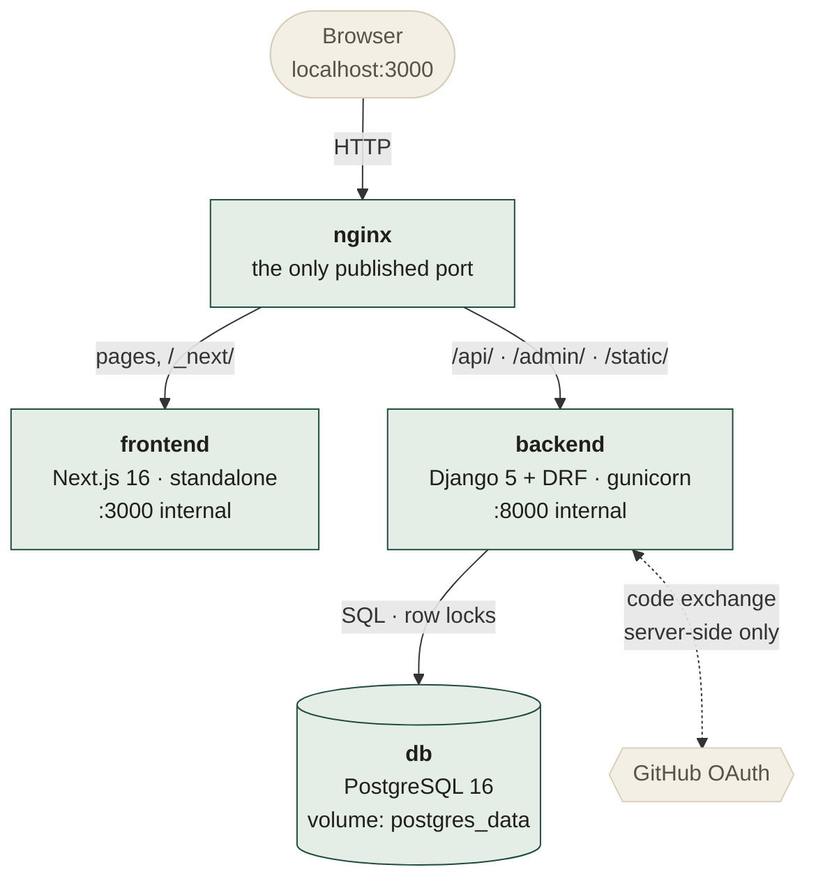
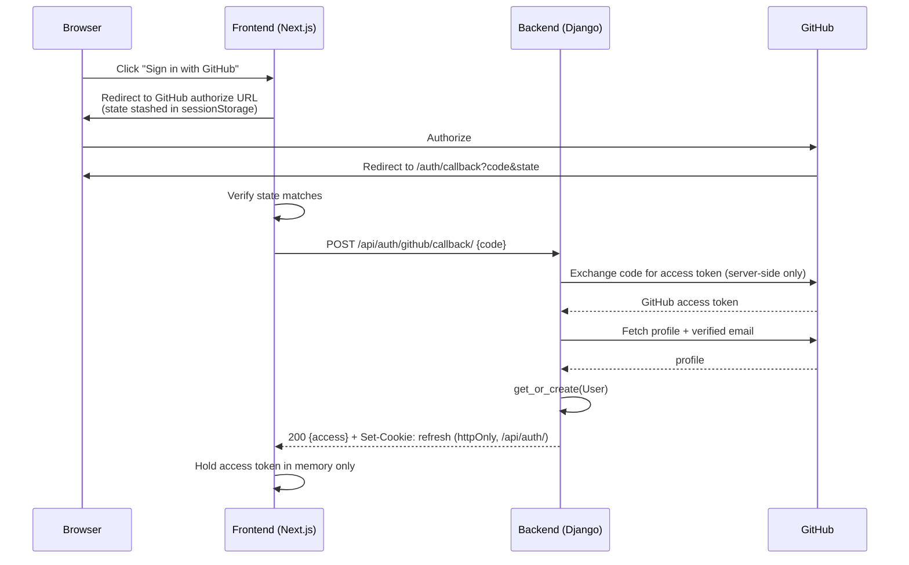
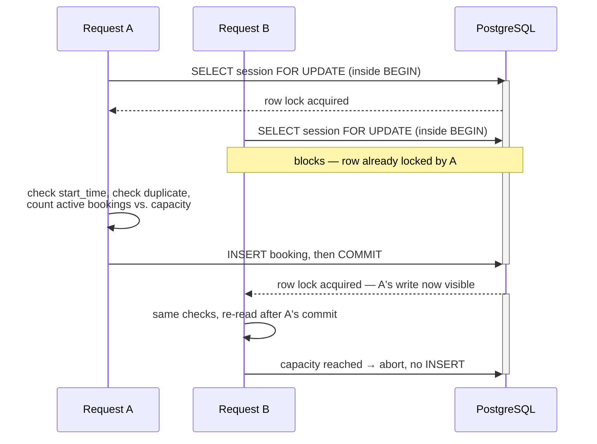

# Velora

A compact sessions marketplace: creators host live sessions, users
browse and book them. Built as a full-stack candidate assignment,
prioritizing correctness and defensible engineering decisions — with a
frontend deliberately designed rather than left at framework defaults
(see [Design](#design) below).

- **Backend:** Django 5 + Django REST Framework, PostgreSQL 16
- **Frontend:** Next.js 16 (App Router, client-side, TypeScript, Tailwind v4)
- **Auth:** GitHub OAuth → backend-issued JWT access/refresh tokens
- **Infra:** Docker Compose (Nginx + frontend + backend + Postgres)

See also: [DECISIONS.md](DECISIONS.md) (non-trivial engineering
choices), [DEBUGGING.md](DEBUGGING.md) (real bugs found and fixed),
[PROMPT_LOG.md](PROMPT_LOG.md) (how AI was used on this project), and
[the final verification report](docs/VELORA_FINAL_VERIFICATION_REPORT.pdf)
(every requirement checked against evidence, with the live test output
and screenshots behind each claim).

**Human action required before this runs end-to-end:** create a GitHub
OAuth App and put its Client ID/Secret in `.env` — see [GitHub OAuth
App](#2-github-oauth-app) below. This is the one step that genuinely
can't be automated (no API for creating OAuth Apps, and the secret
shouldn't be typed anywhere but your own `.env`). Everything else in
this README — Docker, tests, migrations — has already been run and
verified as part of building this project, not left for you to check.

---

## Preview

<table>
<tr>
<td width="50%"></td>
<td></td>
</tr>
<tr>
<td>Landing — what Velora is, before you're asked to sign in.</td>
<td>Catalog — server-side search, live seat counts, no auth required.</td>
</tr>
<tr>
<td></td>
<td></td>
</tr>
<tr>
<td>Session detail — the panel knows whether <em>you</em> already hold a seat.</td>
<td>Creator dashboard — live booking counts against capacity.</td>
</tr>
</table>

Captured against the real running stack with the demo data in
`tools/seed_demo.py`. A deployment you start yourself begins genuinely
empty; run that script if you want the same data to look at.

---

## Architecture



Frontend and backend are never published directly — only Nginx binds a
host port, so everything shares one origin. The client secret lives on
the backend and is used in exactly one place, the dashed edge above.

Four Docker Compose services — `nginx`, `frontend`, `backend`, `db` —
each with one job. Nginx is the single entrypoint the browser talks
to, so frontend and API share one origin: no CORS, and the
refresh-token cookie can be a plain `SameSite=Lax` cookie (see
[DECISIONS.md](DECISIONS.md) #3 for why that trade-off was made
deliberately, not by default).

**Backend apps** (`backend/apps/`):
- `accounts` — custom `User` model (`role: user|creator`), GitHub OAuth
  exchange, JWT issuance/refresh/logout, profile.
- `catalog` — `Session` model, public read + creator-owned CRUD.
- `bookings` — `Booking` model, the capacity-safe booking service, and
  the concurrency proof (`prove_concurrency` management command).
- `core` — health check, shared permissions, uniform API error envelope.

**Frontend** (`frontend/src/`): landing page (`/`), searchable catalog
(`/sessions`), session detail + booking, login + OAuth callback,
profile, booking history, creator dashboard + session CRUD forms. `src/lib/auth-context.tsx` and `api-client.ts` hold
the auth/token machinery; every other page is a thin consumer of it.
`src/components/ui/` holds the shared design-system primitives (`Button`,
`Card`, `Dialog`, `Tabs`, form fields) every page is built from.

---

## Design

Deliberately not a default component-library look. Fraunces (serif)
carries all display/headline type; Inter stays confined to UI and body
text — the combination is what keeps a warm, editorial identity from
reading as "just Inter with a gradient." Warm paper background, a
single restrained pine-green accent instead of default blue/purple,
tokens defined once in `globals.css` and consumed everywhere via
Tailwind's `@theme`. No UI dependencies were added — the delete
confirmation dialog uses the native `<dialog>` element rather than a
modal library, motion respects `prefers-reduced-motion`, and every
interactive element has a visible focus state. Full reasoning for both
the identity choice and the native-dialog decision is in
[DECISIONS.md](DECISIONS.md) #4–5, including a color-contrast bug the
palette shipped with initially and how it was caught (DEBUGGING.md #8a).

---

## Setup

### Prerequisites

- Docker + Docker Compose
- A GitHub account (to register an OAuth App — see below)

### 1. Environment

```bash
cp .env.example .env
```

Fill in `DJANGO_SECRET_KEY` (any long random string —
`python -c "import secrets; print(secrets.token_urlsafe(50))"` works),
a `POSTGRES_PASSWORD`, and the GitHub OAuth values below.

### 2. GitHub OAuth App

Create one at **github.com → Settings → Developer settings → OAuth
Apps → New OAuth App**:

- Homepage URL: `http://localhost:3000`
- Authorization callback URL: `http://localhost:3000/auth/callback`

Put the generated Client ID / Secret into `.env` as `GITHUB_CLIENT_ID` /
`GITHUB_CLIENT_SECRET`. The client ID is also read at frontend build
time to construct GitHub's authorize URL (it's public by design — only
the secret is sensitive, and it never leaves the backend).

**If you edit `.env` after already running `docker compose up`**, both
`GITHUB_CLIENT_ID` and `GITHUB_OAUTH_REDIRECT_URI` are baked into the
frontend image as Docker build args, not read at container start — a
plain restart won't pick up the change. Rebuild instead:
`docker compose up --build -d`.

### 3. Run

```bash
docker compose up --build
```

Then open **http://localhost:3000**. Django admin is at
`/admin/` (create a superuser with
`docker compose exec backend python manage.py createsuperuser` if you
want to browse the data directly).

---

## How authentication works



The client secret is used in exactly one place — the `D->>G` exchange
above — and never reaches the browser.

1. Frontend redirects to GitHub's OAuth authorize URL with a random
   `state` value stashed in `sessionStorage` (CSRF protection).
2. GitHub redirects back to `/auth/callback?code=...&state=...` (or
   `?error=...` if the user cancelled/denied — see below).
3. Frontend verifies `state` matches, then POSTs `code` to
   `/api/auth/github/callback/`.
4. Backend exchanges the code for a GitHub access token **server-side**
   (the client secret never reaches the browser), fetches the GitHub
   profile + verified email, and get-or-creates a `User`.
5. Backend returns a short-lived JWT **access token** in the response
   body and sets the **refresh token** as an httpOnly, `SameSite=Lax`
   cookie scoped to `/api/auth/`.
6. The frontend keeps the access token in memory only (never
   `localStorage`) and attaches it as `Authorization: Bearer <token>`.
   On any 401, or on a fresh page load, it silently calls
   `/api/auth/refresh/` (cookie-based) for a new access token before
   giving up and treating the user as logged out.

**Error cases handled:**
- **Expired/invalid access token** → `401` with `{"error": {"code":
  "token_not_valid", ...}}`; the frontend retries once through a
  silent refresh, then clears auth state if that also fails.
- **OAuth cancellation/denial** (`?error=access_denied` from GitHub) or
  a failed code exchange (expired code, GitHub unreachable) → the
  callback page shows a plain-language message and a link back to
  `/login`, never a crash or a raw error dump.
- **User calling a creator-only endpoint** → `403` from a real DRF
  permission class (`IsCreator` / `IsSessionOwnerOrReadOnly`), not a
  hidden frontend button. See `backend/apps/core/permissions.py`.
- **Creator editing another creator's session** → `403`, enforced by an
  **object-level** permission check (`obj.creator_id ==
  request.user.id`), so a crafted request against someone else's
  session id is rejected server-side regardless of what the frontend
  would show.

### Roles

`User.role` is `"user"` or `"creator"`. There's no separate
creator-application flow in this brief, so becoming a creator is a
self-service profile update (`PATCH /api/auth/me/ {"role": "creator"}`,
exposed as a "Become a creator" button on the profile page). This only
ever grants the ability to manage your *own* sessions — it's not a
path to `is_staff`/`is_superuser`, which aren't exposed by that
endpoint at all.

---

## Session & booking flow

- **Public:** catalog (`GET /api/sessions/`) and session detail
  (`GET /api/sessions/:id/`) — no auth required.
- **Creator:** create/update/delete their own sessions
  (`POST`/`PATCH`/`DELETE /api/sessions/:id/`), and view their own
  sessions with live booking counts (`GET /api/sessions/mine/`).
- **User:** book a session (`POST /api/bookings/`), view active/past
  bookings (`GET /api/bookings/me/?scope=active|past`), cancel an
  active booking (`DELETE /api/bookings/:id/`, which frees the seat).

## Booking concurrency strategy

**The invariant:** a session's active bookings can never exceed its
capacity, even under real concurrent requests. The database is the
authority for this — not the view, not the frontend:



`B` is not rejected because of a stale flag or a retry — it is
physically blocked at `SELECT ... FOR UPDATE` until `A`'s transaction
resolves, so its capacity check always runs against data that already
includes `A`'s booking. Full reasoning and the rejected alternatives
(optimistic locking, naive check-then-insert) are in
[DECISIONS.md](DECISIONS.md); summary:

- `select_for_update()` locks the `Session` row inside
  `transaction.atomic()` while `create_booking()` counts active
  bookings and decides whether there's a free seat — a second
  concurrent request on the same session blocks until the first
  transaction commits, so it always sees the up-to-date count.
- A **partial unique DB constraint**
  (`unique_active_booking_per_user_session`) independently prevents the
  same user from holding two active bookings for the same session, as
  defense in depth.
- Booking a session whose `start_time` has already passed is rejected.

**Proof, not assertion:**
- `backend/apps/bookings/tests/test_concurrency.py` fires 12 real
  concurrent HTTP requests (real threads, real DB connections,
  synchronized with a `Barrier`) at a capacity-1 session and asserts
  exactly one succeeds — plus a capacity-3 variant, a same-user
  double-submit variant, and 5 repeated trials to catch flakiness.
  **This test was verified to actually catch the bug**: temporarily
  removing `select_for_update()` made all 12 requests succeed
  (oversubscribing a 1-seat session 12×); restoring it brought it back
  to exactly 1. See DEBUGGING.md/DECISIONS.md for that experiment.
- `python manage.py prove_concurrency [--contenders N]` is a standalone,
  test-suite-independent reproduction of the same race, runnable
  directly:
  ```bash
  docker compose exec backend python manage.py prove_concurrency --contenders 15
  ```
  This was also run against the live Docker deployment via real HTTP —
  12 simultaneous `POST /api/bookings/` from 12 distinct authenticated
  users, through Nginx, at gunicorn's three worker processes, all
  released at the same instant by a thread barrier. Result: **1 × `201`,
  11 × `409 session_full`**, and the session's own API then reported
  `seats_taken=1, capacity=1`. Separate processes, separate database
  connections, no test harness in the loop.

---

## Tests

```bash
cd backend
source .venv/bin/activate   # or: pip install -r requirements.txt into your own venv
pytest
```

Or inside Docker: `docker compose exec backend python -m pytest`.

(Most tests are pytest-style and won't be picked up by plain
`python manage.py test`, which only discovers `TestCase`/
`TransactionTestCase` subclasses — that command alone only runs the 4
concurrency tests in `test_concurrency.py`. Use `pytest` for the full
suite.)

**69 backend tests**, covering:
- Auth: missing/invalid/expired token → 401; profile update; role
  self-service; invalid role value rejected.
- Catalog: public read without auth; creator-only create (403 for a
  plain user); cross-creator edit/delete rejection (403); `mine` with
  live booking counts; server-side search; per-viewer
  `viewer_has_booked`; capacity that can't be cut below existing
  bookings; sessions that can't be created or moved into the past.
- Bookings: success, duplicate-booking rejection, full-session
  rejection, already-started rejection, cancel-then-rebook, cancel
  frees a seat for someone else, cannot cancel another user's booking,
  cannot cancel a booking once its session has started, a host being
  refused a seat on their own session, malformed ids answering 404
  rather than 500, mass-assignment probes on both write endpoints, and
  the specific edge case where re-booking your own only seat must
  return `duplicate_booking` rather than `session_full`.
- **Core:** the shared error envelope returns a stable `code` even for
  Django's generic 404s (a real bug found and fixed during a later
  audit pass — see DEBUGGING.md #6).
- **Concurrency:** the race tests described above, including a
  same-user double-submit race run at capacity=1 specifically.

Two deliberately skeptical audit passes were run over this "finished"
project before submission, each re-verifying every claim from scratch
rather than trusting the previous pass's report, and attacking the
running deployment with hand-crafted requests. Between them they found
and fixed eleven real defects — including one that broke
`docker compose up --build` for anyone who cloned the repository. Every
one is written up in [DEBUGGING.md](DEBUGGING.md) with the symptom,
the diagnosis, and how the fix was verified.

Frontend: `cd frontend && npx eslint . && npx tsc --noEmit && npm run
build` — all pass clean. UI flows (catalog, login, booking, seat-count
updates, creator dashboard, role-gated redirects) were also verified by
driving the real running app with a headless browser against the real
backend + Postgres, not just typechecked.

---

## Database persistence

Postgres data lives in a named Docker volume (`postgres_data`), which
is independent of the container lifecycle. Verified directly: created
data, ran `docker compose restart backend db` (data intact), then a
full `docker compose down` + `up` (containers recreated, volume
untouched, data still intact). Data is only lost with an explicit
`docker compose down -v`.

---

## Known limitations

- No password/email login — GitHub OAuth only, per the brief's choice
  of provider. Losing GitHub access means losing account access.
- No rate limiting on booking/auth endpoints. Not required by the
  brief; would matter before any real deployment.
- No automated end-to-end (Playwright-in-CI) test suite — UI
  correctness was verified manually with a headless browser during
  development, but that verification isn't wired into a repeatable
  test target yet.
- Deleting a session cascades its bookings away and nobody is told.
  The confirmation dialog now names how many people are affected and
  says plainly that Velora won't notify them, but a real product would
  soft-cancel and email rather than delete outright.
- No waitlist: once a session is full, the only way in is for someone
  to cancel and for you to notice.
- The catalog paginates at 20 per page server-side, but the frontend
  renders only the first page — there's no "load more" yet.
- Single Nginx origin means frontend and backend availability are
  coupled behind one proxy; fine at this scale, worth revisiting if
  they were ever split across hosts.

## What I'd improve with another day

- Rate limiting (DRF throttling) on auth and booking endpoints.
- An email/notification hook on successful booking and on a creator
  cancelling a session out from under existing bookings.
- Pagination or infinite scroll on the catalog beyond the first page.
- A CI workflow running the backend test suite and frontend
  lint/typecheck/build on every push.
- Automated visual regression coverage for the design system (the
  responsive/contrast/functional passes described in DEBUGGING.md #7–8
  were done manually with a real browser; a repeatable Playwright suite
  would catch a regression the next time a component changes).
- Filtering the catalog by date range or location, alongside the
  free-text search that exists now.
- Soft-cancelling a session instead of deleting it, so attendees keep a
  record of what happened rather than the booking simply vanishing.
